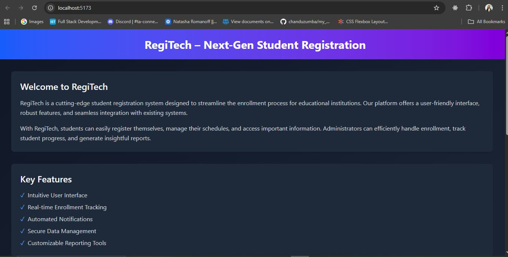
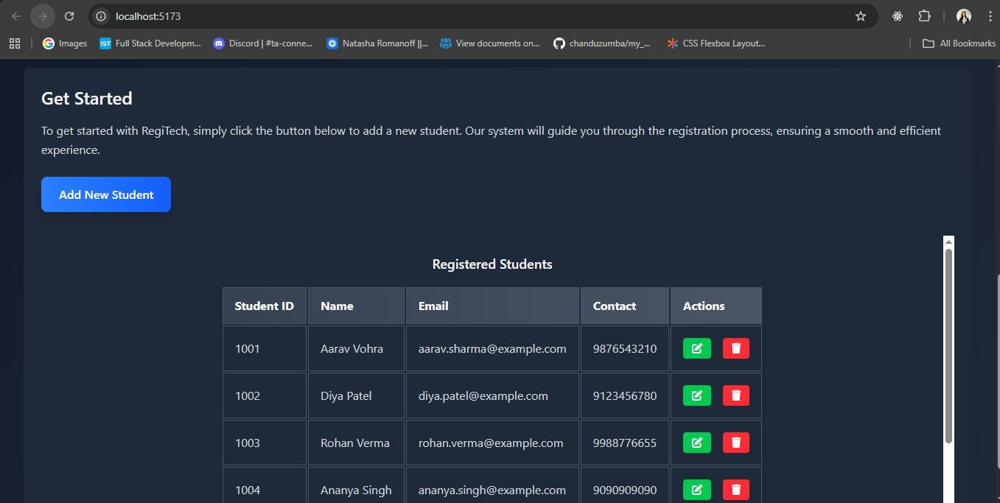
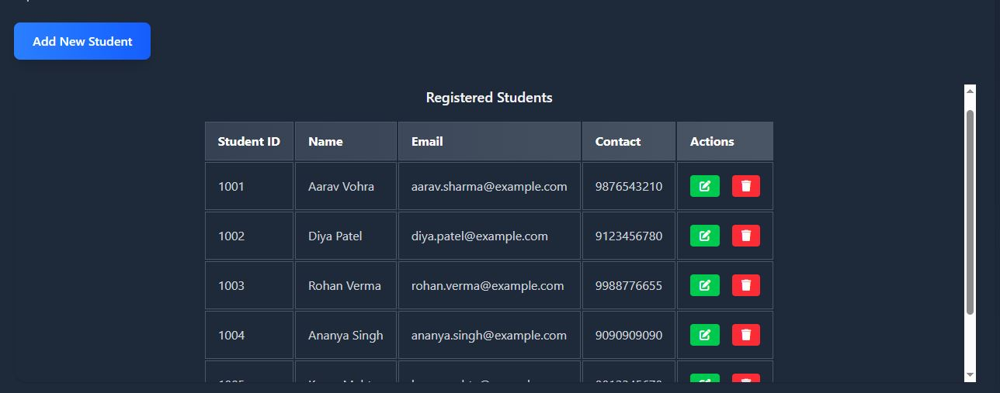
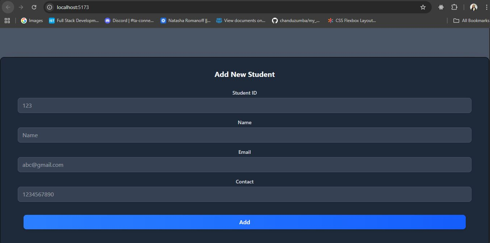
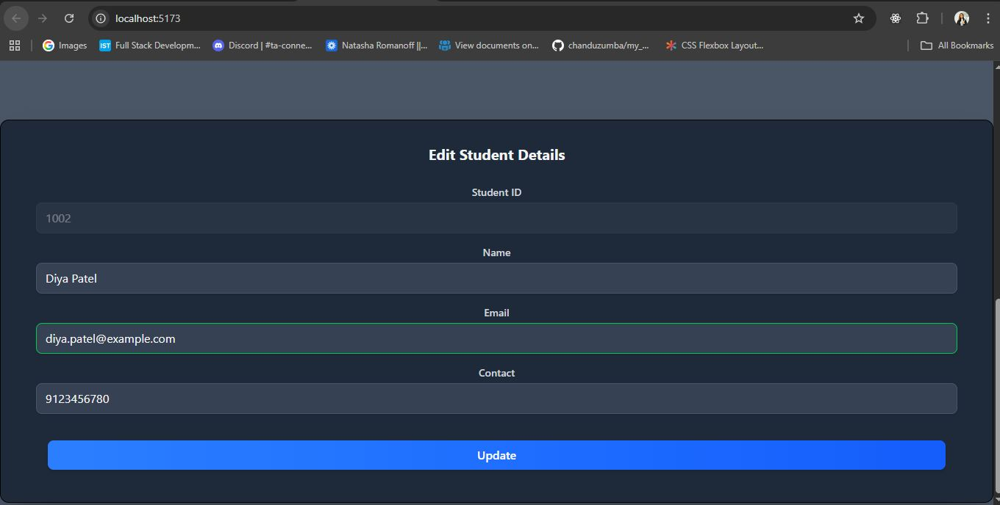
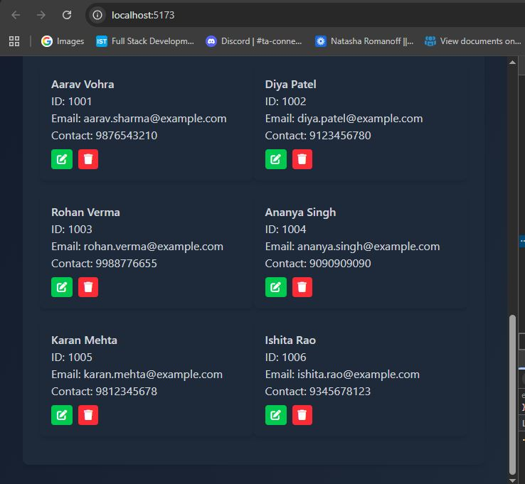
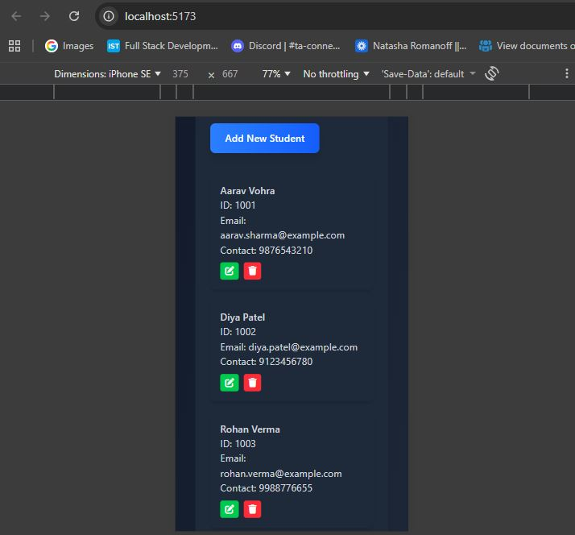

📘 Student Registration System

A cutting-edge student registration system designed to streamline the enrollment process for educational institutions with a clear execution flow, component overview, and visual guidance.

Github link - https://github.com/chanduzumba/student-registration

🚀 Architecture & Execution Flow

Below is a step-by-step flow of how the system works from the user perspective and within the application:

flowchart TD
    A[Load index.html] --> B[Initialize UI]
    B --> C[Load localStorage students]
    C --> D{Are there student records?}
    D -- Yes --> E[Display records in Table & Grid]
    D -- No --> F[Show “No student records” Message]
    B --> G[User Clicks “Add New Student”]
    G --> H[Open Add Form Modal]
    H --> I[User Submits Form]
    I --> J{Is it Add or Update?}
    J -- Add --> K[Add to localStorage + UI]
    J -- Update --> L[Update existing student in localStorage + UI]
    K --> M[Refresh display]
    L --> M
    E --> N[Edit/Delete Buttons]
    N --> O[Edit opens modal / Delete removes record]

🧠 Detailed Execution Flow
1. Page Load & Initialization

index.html renders the page. HTML includes UI structure like title, “Add New Student” button, and student list layout.
main.js runs on page load.
It retrieves existing student data from localStorage (or uses a default sample list).

2. Check Stored Records

The code checks if localStorage contains student records.
If records exist, it displays them dynamically in a table and a grid layout.
If no records, it shows a “No student records found” info message.

🗂️ Folder Structure

📸 Screenshots

You should capture and include screenshots like the following (place them in a screenshots/ folder and reference them):

🏠 Home Page

📝 Add Student Button

Student Records

Add New Student Modal

Edit Student

Grid View

grid mobile view

🛠️ Getting Started
📦 Prerequisites

Make sure you have Node.js and npm installed.

npm install

Then start the app:

npm run dev

📅 User Interactions & Forms
💡 Add New Student

Open modal — triggered when user clicks the add button.
Submit form:
If student ID is unique, a new record is added to both the table and grid UI.
The new student is stored in localStorage.
Feedback toast confirms the add action.

✏️ Edit Existing Student

Edit button loads existing data into the form.
After editing and submit:
The code updates that student’s details in localStorage.
UI table and grid are updated accordingly.

A toast message confirms success.

🗑️ Delete Student

Clicking delete removes the student from:
localStorage
Table view
Grid view
A toast confirms the deletion action.

📌 Diagram Explanation Key

Below is the visual logic of how actions connect:
Load UI → Fetch storage → Display: ensures persisted data appears on page load.
Button clicks → modals → form submission → update logic: key event handling in main.js.
Conditional logic distinguishes between adding and updating student records.

Note on Styling

style.css imports Tailwind CSS utility classes (so most styles are from Tailwind framework).

📌 Summary (How the App Works)

✨ React-free, vanilla JavaScript student manager
✨ Uses localStorage for persistence
✨ Adds, edits, deletes student records dynamically
✨ Shows both table and grid views
✨ Includes real-time UI toast notifications

