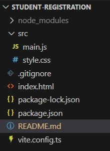

# 📘 Student Registration System

A simple and interactive **Student Registration Application** built
using **HTML, Tailwind CSS, and Vanilla JavaScript**.

This project allows users to add, view, edit, and delete student
records. All data is stored locally in the browser using `localStorage`,
making it lightweight and easy to run without a backend.

------------------------------------------------------------------------

## 🧠 Overview

This project demonstrates:

-   Dynamic DOM manipulation
-   CRUD operations (Create, Read, Update, Delete)
-   Browser-based data persistence using `localStorage`
-   Responsive table and card layouts
-   Clean and modern UI styling

It is ideal for beginners learning JavaScript fundamentals and front-end
development.

------------------------------------------------------------------------

## 🚀 Features

✔ Add new student records\
✔ View students in both table and card views\
✔ Edit existing student details\
✔ Delete student records\
✔ Toast notifications for actions\
✔ Persistent data using browser localStorage\
✔ Responsive UI design

------------------------------------------------------------------------

## 🛠️ How to Run the Project

1.  Clone the repository:

    git clone https://github.com/chanduzumba/student-registration.git

2.  Navigate to the project folder.

3.  Make sure Node.js is installed. 

    -npm install

    -npm run dev
    
    -click on http://localhost:5173/ to see the web page locally.

------------------------------------------------------------------------

## 📄 How It Works

1.  When the page loads, student data is retrieved from `localStorage`.
2.  If no data exists, a default empty state is shown.
3.  Users can add students through the form modal.
4.  Records update instantly in the UI and are saved to `localStorage`.
5.  Edit and delete buttons allow updating or removing student entries.
6.  Toast messages provide user feedback after actions.

All operations happen entirely in the browser.

------------------------------------------------------------------------

## 📂 Project Structure

------------------------------------------------------------------------

## 🧑‍💻 Technologies Used

-   HTML5
-   Tailwind CSS
-   JavaScript (ES6+)
-   Browser localStorage

------------------------------------------------------------------------

## 🤝 Contributing

Contributions are welcome!

1.  Fork the repository
2.  Create a new branch (git checkout -b feature-name)
3.  Commit your changes (git commit -m "Add feature")
4.  Push to your branch (git push origin feature-name)
5.  Open a Pull Request

------------------------------------------------------------------------

## 📜 License

This project is licensed under the MIT License.

------------------------------------------------------------------------

## 📬 Contact

Created as a learning project for practicing frontend development and
CRUD functionality.

Happy Coding! 🎓✨
